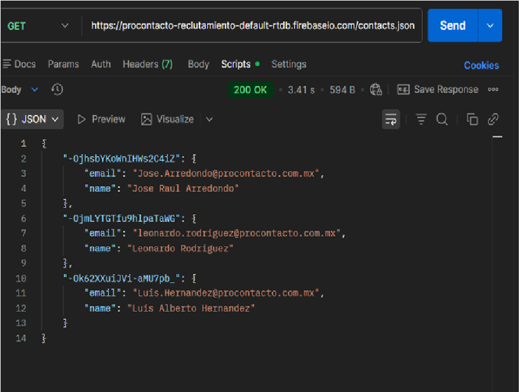
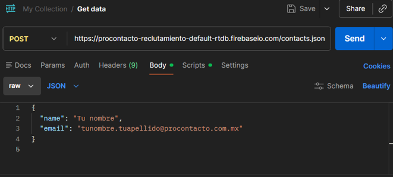
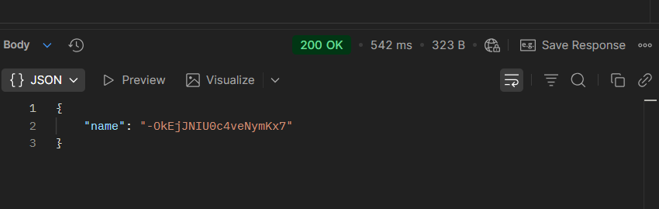
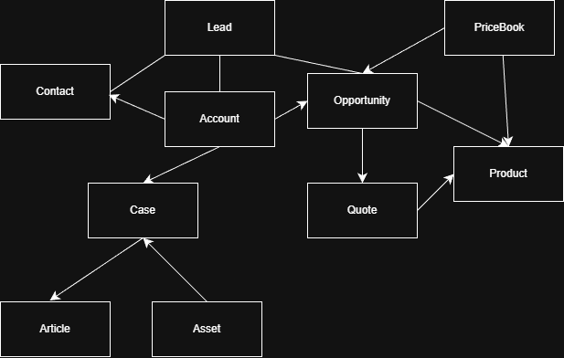
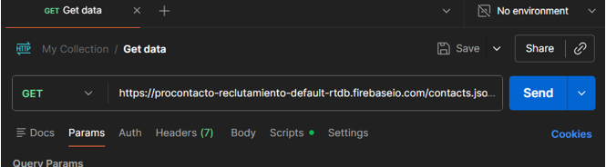
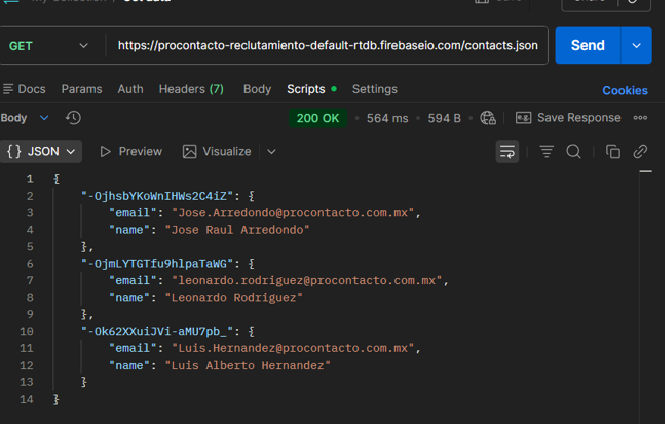

# Repositorio – Trabajo Práctico Salesforce / Pro Contacto

## Introducción
El presente repositorio documenta los ejercicios solicitados como parte del proceso de evaluación técnica. El objetivo es validar conocimientos básicos de instalación de herramientas de desarrollo, consumo de servicios web mediante API REST, manejo de JSON y fundamentos de la plataforma Salesforce, incluyendo Trailhead y Apex.

------

## Ejercicio 1 – Instalación del ambiente

El objetivo de este ejercicio es preparar el entorno de desarrollo necesario para la realización del trabajo práctico.

### Herramientas instaladas

#### Visual Studio Code
Visual Studio Code es un Entorno de Desarrollo Integrado (IDE) utilizado para el desarrollo de aplicaciones web y móviles. Permite trabajar con múltiples lenguajes y tecnologías como HTML, CSS, JavaScript, C#, Apex, NodeJS, Angular, Ionic, React y TypeScript.

#### Git y Git Bash
Git es una herramienta de control de versiones que permite gestionar el historial de cambios del código fuente, mantener respaldos de versiones anteriores y restaurarlas cuando sea necesario. Git Bash proporciona una interfaz de línea de comandos para interactuar con Git de forma eficiente.

------

## Ejercicio 2 - Conceptos estandar

En este ejercicio se responden preguntas teóricas para comprender los conceptos fundamentales del protocolo HTTP

### Preguntas:

#### ¿Qué es un servidor HTTP?
Es un software donde se almacenan archivos de una página web, el cual tiene como objetivo dar respuesta a la solicitud de un usuario y entregar el contenido solicitado usando el “Protocolo de Transferencia de Hipertexto (HTTP)”.

#### ¿Qué son los verbos HTTP? Mencionar los más conocidos
Son las palabras clave que el cliente utiliza para realizar una acción. Entre las más comunes encontramos:
- Get: Se usa para obtener un recurso indicado. En donde al haber diferentes peticiones arrojan el mismo resultado.  
- Delete: Elimina el recurso identificado mediante el URL.
- Post: Se utiliza para crear nuevos recursos.
- Put: El recurso recibe una actualización y/o en caso de no existir crea uno nuevo.
- Patch: Permite la actualización parcial del recurso en donde se indica que operación se quiere realizar.

#### ¿Qué es un request y un response en una comunicación HTTP?
Un request es la petición que el usuario hace a un servidor para solicitar una acción especifica, por ejemplo, solicitar una pagina web, una herramienta, etc. Y un response es la respuesta que el servidor envía al usuario para resolver su solicitud.

#### ¿Qué son los headers?
Se encargan de transmitir información durante una solicitud  o una respuesta a una página solicitada en el protocolo HTTP. 

#### ¿Qué es un queryString? (En el contexto de una url)
Son diferentes parámetros en una URL, las cuales se encuentran después de un signo de interrogación (?) y se encargan de transmitir información sobre un servidor web.

#### ¿Qué es el responseCode? ¿Qué significado tiene los posibles valores devueltos?
El responsecode son mensajes que los servidores web da al usuario cuando se procesa una solicitud y da un mensaje dependiendo el caso (si la solicitud fue exitosa, si hay un error o si se debe realizar alguna acción extra).
Los valores principales son:
- 1xx: Significa que la solicitud fue recibida y sigue el proceso.
- 2xx: La solicitud fue recibida y aceptada correctamente.
- 3xx: El usuario debe realizar algún cambio adicional para poder completar la solicitud.
- 4xx: Hay un error en la solicitud por parte del usuario y no puede ser procesada.
- 5xx: Hay un error en el servidor y por consecuencia no es posible cumplir con la solicitud.

#### ¿Cómo se envía la data en un Get y cómo en un POST?
La data en un Get envía los datos del cliente al servidor agregándolos como parámetros de consulta en la URL, con este método los datos enviados son escritos después del signo de interrogación en la URL.
El POST envía los datos mediante un cuerpo en la solicitud de HTTP y no es visible en la URL.

#### ¿Qué verbo http utiliza el navegador cuando accedemos a una página?
El verbo GET ya que, al introducir una URL en el navegador, envía una solicitud con el método GET para obtener el recurso principal.

#### Explicar brevemente qué son las estructuras de datos JSON y XML dando ejemplo de estructuras posibles.
La estructura de datos JSON es un formato que se utiliza para la especificación de datos en las aplicaciones o sitios web y destaca por el intercambio de datos entre sistemas informáticos. 

**Ejemplo JSON:**

```json
{
  "usuario": {
    "id": 1,
    "nombre": "Brady",
    "correo": "brady@email.com"
  }
}

```

Y la estructura XML es una forma de organizar y representar en un lenguaje diseñado para almacenar, transportar y recibir datos de manera legible.

**Ejemplo XML:**

```xml

<usuario>
  <id>1</id>
  <nombre>Brady</nombre>
  <correo>brady@email.com</correo>
</usuario>

```

#### Explicar brevemente el estándar SOAP
Es un protocolo que se utiliza para el intercambio de mensajes entre sistemas y tiene como objetivo facilitar la comunicación con distintas plataformas, lenguajes o sistemas operativos.

#### Explicar brevemente el estándar REST Full
El RESTful funciona como un estándar para compartir información en un sistema de consulta y respuesta el cual permite crear servicios web eficientes y fáciles de usar. 

#### ¿Qué son los headers en un request? ¿Para qué se utiliza el key Content-type en un header?
Los headers en un request son parámetros que el cliente envía a un servidor mediante una solicitud HTTP que proporciona información adicional sobre la solicitud del usuario.
El key Content-Type se utiliza para indicar el medio en el que se transmite el contenido que se esta enviando en el cuerpo de una solicitud o respuesta. Principalmente se utiliza para informar al usuario sobre como procesar los datos.

-----

## Ejercicio 3 – Requests HTTP con Postman

En este ejercicio se realizaron solicitudes HTTP utilizando Postman para interactuar con un endpoint REST y analizar el comportamiento de los métodos GET y POST.

### Request GET inicial

Se realizó una solicitud GET para obtener el estado inicial de los datos almacenados en el endpoint.



### Request POST

Se realizó una solicitud POST enviando un objeto JSON en el cuerpo de la petición para agregar un nuevo registro al servidor.



### Request GET final

Se realizó nuevamente una solicitud GET para verificar que el registro enviado mediante POST fue almacenado correctamente.



### Diferencias observadas entre el punto 1 y el punto 3

En la primera solicitud GET se obtiene el estado inicial de los datos almacenados en el servidor.  
En la tercera solicitud GET, después de realizar el POST, la respuesta incluye el nuevo registro agregado, lo que confirma que la información fue almacenada correctamente.

---

## Ejercicio 5 – Objetos estándar de Salesforce

En este ejercicio se describe, de forma conceptual, qué información almacena cada objeto estándar de Salesforce y cómo se relacionan entre sí dentro del modelo de datos.

Las relaciones se representan en un diagrama UML realizado en Draw.io, el cual se incluye al final de este ejercicio.

### Objetos incluidos
- Lead
- Account
- Contact
- Opportunity
- Product
- PriceBook
- Quote
- Asset
- Case
- Article

#### Lead
**¿Qué es?**

Es un registro en donde el cliente ha mostrado interés en un producto o servicio de la empresa. Esta diseñado para gestionar a los prospectos desde su primera interacción con la marca hasta que se convierten en clientes.

**¿Qué datos almacena?**

-	Nombre completo 
-	Información de contacto
-	Ubicación
-	Origen del lead 
- Estado del lead
- Propietario del lead 
-	Fecha de creación y última modificación
-	Notas adicionales y campos personalizados 

**¿Con cuáles se relaciona?**

Tiene relación indirecta con: 
- Account: Durante la conversión, el lead se transforma en una cuenta (empresa). 
-	Contact: Los datos personales del lead se convierten en un contacto. 
-	Opportunity: Si se configura, se puede crear una oportunidad de venta asociada al proceso de conversión. 

#### Account
**¿Qué es?**

Es el objeto que representa una cuenta individual, ya sea de una organización, cliente, competidor o socio. Ayuda a gestionar las entidades dentro de la plataforma.

**¿Qué datos almacena?**

-	Nombre de la empresa (razón social)
	Dirección postal
-	Ciudad, país y código postal
-	Teléfono principal
-	Número de empleados
-	Industria y tamaño de la empresa

**¿Con cuáles se relaciona?**

- Contact: Un contacto está asociado a una cuenta. 
- Opportunity: Una oportunidad pertenece a una cuenta. 
- Asset: Un Activo está vinculado a una cuenta. 
- Case: Un Caso se relaciona con una cuenta.

#### Contact
**¿Qué es?**

Es un objeto estándar que representa a personas con las que la organización tiene una relación comercial.

**¿Qué datos almacena?**

-	Nombre completo 
-	Información de contacto
-	Cargo o título 
-	Relación con la cuenta
-	Datos adicionales estándar
-	Campos personalizados

**¿Con cuáles se relaciona?**

- Account: Cada contacto está vinculado a una cuenta mediante un campo de búsqueda.
- Opportunity: Permite definir el rol de un contacto en una oportunidad
- Quote: Puede estar relacionado indirectamente a través de una opportunity si la cotización está ligada a una oportunidad que incluye contactos.
- Asset: Puede estar asociado indirectamente a un contacto y una cuenta, útil para rastrear productos vendidos.
- Case:  Un caso se asocia a un contacto para gestionar soporte.

#### Opportunity

**¿Qué es?**

Es un objeto estándar que representa una venta potencial o un trato pendiente con un cliente

**¿Qué datos almacena?**

-	Nombre de la oportunidad
-	Monto (Amount): 
-	Fecha de cierre (Close Date): 
-	Etapa de la oportunidad (Stage): 
-	Probabilidad (%): 
-	Tipo (Type): 
-	Fuente de la oportunidad (Lead Source): 
-	Cuenta relacionada (Account) 
-	Contacto principal: 
-	Descripción: 

**¿Con cuáles se relaciona?**

-	Account: Representa la empresa con la que se está negociando.
-	PriceBook (Lista de precios): Solo se pueden agregar productos de ese Pricebook a la oportunidad. 
-	Quote:   La cotización refleja los productos, precios y términos ofrecidos al cliente
-	Product: Los productos se agregan a una oportunidad a través de Opportunity Products que representan los ítems específicos que se están vendiendo.

#### Product

**¿Qué es?**

Representa los productos o servicios que una empresa vende.

**¿Qué datos almacena?**

-	Nombre del Producto 
-	Código del Producto 
-	Descripción 
-	Precio de Lista 
-	Unidad de Medida 
-	Familia (Product Family) 
-	Activo – Indica si el producto está disponible para su venta (sí/no).
-	URL de la Imagen 
-	Fecha de Activación/Desactivación 

**¿Con cuáles se relaciona?**

- PriceBook: Define el precio de un producto en un libro de precios específico.  Es una relación de muchos a muchos.
- Opportunity: Los productos se agregan a una oportunidad de venta.  Esta relación permite rastrear qué productos se están vendiendo y en qué cantidad. 
- Quote: Se vincula productos con una cotización, mostrando los artículos ofertados al cliente. 
 Asset: Esta relación ayuda en el seguimiento postventa. 
- Case: Los casos de soporte técnico pueden estar relacionados con un Asset para gestionar incidencias sobre un artículo específico.

#### PriceBook

**¿Qué es?**

Es un catálogo que contiene una lista de productos junto con sus precios asociados.  Permite a las empresas gestionar diferentes precios para los mismos productos según segmentos de clientes, regiones, monedas o estrategias comerciales. 

**¿Qué datos almacena?**

- Nombre de la lista de precios 
- Estado de activación: Indica si la lista está activa o inactiva 
- Descripción
- Región u otros campos personalizados

**¿Con cuáles se relaciona?**

- Product: A través del objeto PricebookEntry, que es una relación muchos-a-muchos entre Pricebook y Product. 
- Opportunity: Se asocia con un solo Pricebook. Los productos agregados a la oportunidad deben pertenecer a ese Pricebook. 
- Quote: Esta relacionada para asegurar precios consistentes en la propuesta.

#### Quote

**¿Qué es?**

Es un registro que muestra los precios propuestos para productos y servicios. 

**¿Qué datos almacena?**

-	Datos generales 
-	Relaciones clave 
-	Detalles financieros
-	Información de envío y facturación
-	Productos y líneas de cotización
-	Sincronización con oportunidades 
-	Campos personalizados

**¿Con cuáles se relaciona?**

- Account: Se asocia a una cuenta (cliente). 
- Contact: Puede estar vinculado a uno o más contactos a través de la Account u Opportunity asociada.
- Opportunity: Se crea a partir de una Opportunity y puede marcarse como Primary Quote para sincronización.
- Product: A través de Quote Line Items, que contienen los productos o servicios cotizados. 
- PriceBook: Se utiliza para determinar los precios de los productos incluidos.

#### Asset

**¿Qué es?**

Representa un producto específico adquirido o instalado por un cliente, ya sea de la empresa o de un competidor.

**¿Qué datos almacena?**

- Nombre 
- Producto asociado 
- Cuenta y Contacto 
- Número de serie 
- Fechas clave
- Estado (activo o inactivo)
- Precio y cantidad 
- Activo padre 
- Información de propiedad

**¿Con cuáles se relaciona?**

- Account: Relación obligatoria con la cuenta del cliente. 
- Contact: Relación opcional con el contacto asociado al activo. 
- Product: Vinculación con el producto estándar vendido. 
- Case: Se puede relacionar con un Asset para gestionar soporte técnico del producto.
  
#### Case

**¿Qué es?**

Es el objeto diseñado para gestionar todas las interacciones de los clientes con la empresa, como consultas, quejas, problemas técnicos o solicitudes de soporte.

**¿Qué datos almacena?**

-	Información del caso 
-	Datos del cliente 
-	Detalles operativos
-	Asignación: Agente de soporte asignado,
-	Historial de interacciones
-	Automatización: Campos para reglas de asignación

**¿Con cuáles se relaciona?**

- Account: El caso está vinculado a la cuenta del cliente.
- Contact: El caso se asocia con una persona específica del cliente.
- Asset: Permite vincular el caso a un producto o activo específico vendido al cliente.
- Article: pueden vincular artículos de la base de conocimiento al caso para resolver consultas.

#### Article

**¿Qué es?** 

Permite a las organizaciones crear, organizar y distribuir contenido de conocimiento de manera estructurada dentro de la plataforma Salesforce. 

**¿Qué datos almacena?**

-	Título del artículo
-	Cuerpo del contenido (texto, HTML o formatos ricos)
-	Estado (borrador, revisión, publicado, archivado)
-	Versión del artículo
-	Idioma
-	Categorías y etiquetas para clasificación
-	Fecha de creación y modificación
-	Autor o creador del artículo
-	Campos personalizados (como prioridad, producto asociado, etc.)
-	Relaciones con otros objetos, como Casos, Contactos o Cuentas
  
**¿Con cuáles se relaciona?**

- Case: Los artículos de conocimiento se vinculan frecuentemente a casos para ayudar a los agentes a resolver consultas. 
- Contact : Si un caso está relacionado con un contacto y ese caso usa artículos, entonces hay una conexión indirecta. 
- Account: La relación es indirecta a través de Case o Asset, si el caso asociado pertenece a una cuenta.

#### Diagrama UML – Relaciones entre objetos Salesforce

El siguiente diagrama representa visualmente las relaciones entre los objetos estándar documentados anteriormente.



## Ejercicio 6 – Conceptos y funcionalidades de Salesforce

En este ejercicio se responden de forma breve y conceptual distintas preguntas relacionadas con Salesforce, sus principales soluciones, funcionalidades y conceptos generales.  
El objetivo es demostrar el entendimiento básico de la plataforma Salesforce, su modelo de uso en la nube, así como términos comunes utilizados en entornos CRM y de desarrollo.

### Soluciones de Salesforce

**¿Qué es Salesforce?**  
Salesforce es una plataforma que funciona en la nube y sirve para administrar la información de los clientes. Ayuda a las empresas a organizar ventas, servicio y otros procesos en un solo lugar sin necesidad de instalar programas.

**¿Qué es Sales Cloud?**  
Sales Cloud es una solución de Salesforce enfocada en el área de ventas. Permite dar seguimiento a clientes potenciales, oportunidades y cuentas para llevar mejor el proceso de venta.

**¿Qué es Service Cloud?**  
Service Cloud es la herramienta de Salesforce que se usa para atención al cliente. Sirve para gestionar casos, solicitudes y problemas que reportan los clientes desde distintos canales.

**¿Qué es Health Cloud?**  
Health Cloud es una solución especializada para el sector salud. Se utiliza para manejar información de pacientes y mejorar la coordinación entre médicos, clínicas y sistemas de atención.

**¿Qué es Marketing Cloud?**  
Marketing Cloud permite crear y administrar campañas de marketing digital. Ayuda a enviar correos, mensajes y contenido personalizado según el tipo de cliente.

---

### Funcionalidades de Salesforce

**¿Qué es un Record Type?**  
Un Record Type permite manejar diferentes procesos dentro de un mismo objeto. Sirve para mostrar distintos campos, valores y flujos según el tipo de registro.

**¿Qué es un Report Type?**  
Un Report Type define qué información se puede usar al crear un reporte. Determina qué objetos y relaciones estarán disponibles para analizar los datos.

**¿Qué es un Page Layout?**  
Un Page Layout controla cómo se muestran los campos, botones y secciones de un registro. Permite personalizar la vista según el usuario o proceso.

**¿Qué es un Compact Layout?**  
Un Compact Layout muestra los datos más importantes de un registro de forma resumida. Se usa mucho en vistas rápidas y dispositivos móviles.

**¿Qué es un Perfil?**  
Un perfil define qué puede ver y hacer un usuario en Salesforce. Controla accesos a objetos, campos y funciones del sistema.

**¿Qué es un Rol?**  
Un rol define la jerarquía de los usuarios dentro de Salesforce. Sirve para controlar qué información puede ver cada persona según su posición.

**¿Qué es una Validation Rule?**  
Una Validation Rule es una regla que valida que los datos ingresados sean correctos. Evita que se guarde un registro si no cumple ciertas condiciones.

**¿Diferencia entre Master Detail y Lookup?**  
La relación Master Detail depende completamente del registro padre.  
La relación Lookup es más flexible y los registros pueden existir de manera independiente.

**¿Qué es un Sandbox?**  
Un Sandbox es un entorno de pruebas de Salesforce. Se usa para hacer cambios y pruebas sin afectar la información real.

**¿Qué es un Change Set?**  
Un Change Set sirve para mover configuraciones entre entornos. Permite pasar cambios de un Sandbox a producción de forma segura.

**¿Para qué sirve el Import Wizard?**  
El Import Wizard se utiliza para importar datos a Salesforce de forma sencilla. Permite cargar información desde archivos como Excel o CSV.

**¿Para qué sirve Web to Lead?**  
Web to Lead permite crear leads automáticamente desde formularios web. Es útil para captar clientes potenciales desde internet.

**¿Para qué sirve Web to Case?**  
Web to Case permite generar casos automáticamente desde formularios web. Facilita la creación de solicitudes de soporte.

**¿Para qué sirve Omnichannel?**  
Omnichannel distribuye el trabajo entre los agentes de manera inteligente. Ayuda a equilibrar la carga de trabajo en soporte.

**¿Para qué sirve Chatter?**  
Chatter es una herramienta de comunicación interna. Permite a los usuarios colaborar, comentar registros y compartir información.

---

### Conceptos generales

**¿Qué significa SaaS?**  
SaaS significa Software como Servicio. Es un modelo donde el software se usa a través de internet sin instalarlo localmente.

**¿Salesforce es SaaS?**  
Sí, Salesforce es un software SaaS porque se utiliza completamente desde la nube mediante un navegador web.

**¿Qué significa que una solución sea Cloud?**  
Significa que la aplicación está alojada en la nube y se accede por internet sin manejar servidores físicos.

**¿Qué significa On-Premise?**  
On-Premise se refiere a software instalado en servidores propios. La empresa se encarga de su mantenimiento.

**¿Qué es un pipeline de ventas?**  
El pipeline de ventas muestra las etapas por las que pasa una oportunidad. Ayuda a dar seguimiento al proceso comercial.

**¿Qué es un funnel de ventas?**  
El funnel de ventas representa el recorrido del cliente desde el primer contacto hasta la compra.

**¿Qué es Customer Experience?**  
Customer Experience es la experiencia total que tiene un cliente con una empresa. Incluye ventas, soporte y comunicación.

**¿Qué significa omnicanalidad?**  
La omnicanalidad permite atender al cliente por diferentes canales de forma integrada.

**¿Qué significa B2B y B2C? ¿Qué es un KPI?**  
B2B es negocio entre empresas y B2C es negocio hacia consumidores finales.  
Un KPI es un indicador que mide el desempeño de un proceso o negocio.

**¿Qué es una API y en qué se diferencia de REST API?**  
Una API permite la comunicación entre sistemas. REST API es un tipo de API que usa HTTP y formatos como JSON.

**¿Qué es un Proceso Batch?**  
Un proceso Batch ejecuta tareas en segundo plano. Se usa para procesar grandes volúmenes de datos.

**¿Qué es Kanban?**  
Kanban es una metodología visual para organizar tareas. Permite ver el progreso del trabajo.

**¿Qué es un ERP? ¿Salesforce es un ERP?**  
Un ERP gestiona procesos internos como finanzas o inventarios.  
Salesforce no es un ERP, es un CRM, pero puede integrarse con uno.


## Ejercicio 7 - Integración REST y actualización de Contact

### A. Consulta de ID desde Web Service

Se realizó una petición **GET** utilizando Postman al servicio REST proporcionado:

https://procontacto-reclutamiento-default-rtdb.firebaseio.com/contacts.json

La respuesta devuelve un conjunto de registros en formato JSON, donde cada contacto
está identificado por un **ID único generado por Firebase**.  
Este ID será utilizado para consultar un contacto específico.

##### GET inicial (request)


##### GET inicial (response)


Posteriormente, se consultó un registro individual utilizando uno de los IDs obtenidos en la llamada anterior.

Ejemplo de ID utilizado:
- OjhsbYKoWnIHws2C4iZ

##### GET por ID


**URL utilizada:**

https://procontacto-reclutamiento-default-rtdb.firebaseio.com/contacts/-OjhsbYKoWnIHws2C4iZ.json

La respuesta devuelve únicamente los datos del contacto asociado al ID consultado.


